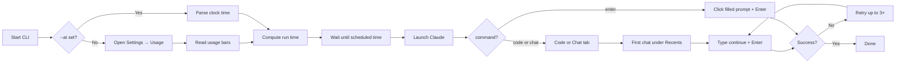

# claude-continue

**Automatically send `continue` in Claude Desktop when your usage limit resets.**

A macOS CLI that reads **Settings → Usage**, waits until the right moment, then opens your first **Recents** chat on the **Code** or **Chat** tab and submits `continue`—so you do not have to babysit the reset clock.

```bash
claude-continue code    # Code tab → first Recents chat → type continue
claude-continue chat    # Chat tab → first Recents chat → type continue
claude-continue enter   # Press Enter in the visible prompt (no navigation)
```

---

## Table of contents

- [How it works](#how-it-works)
- [Requirements](#requirements)
- [Install](#install)
- [Permissions](#permissions)
- [Usage](#usage)
- [Scheduling logic](#scheduling-logic)
- [Sleep and power](#sleep-and-power)
- [UI reference](#ui-reference)
- [Debugging](#debugging)
- [Troubleshooting](#troubleshooting)
- [Limitations](#limitations)
- [Development](#development)
- [License](#license)

---

## How it works



1. **Schedule** — From the Usage page (or `--at`), decide when to run.
2. **Wait** — Try to schedule a system wake; if macOS refuses, prevent idle sleep with `caffeinate`.
3. **Run** — `code` / `chat`: focus Claude, switch tab, open the first chat below **Recents** (skip **Pinned**), send `continue`. `enter`: focus Claude, click the in-view prompt that **already has text**, press **Enter** only (no tab switch, no Recents, no typing).

Claude can be closed during the wait. The tool launches and focuses it at run time.

---

## Requirements

| Requirement | Details |
|-------------|---------|
| **OS** | macOS 13 (Ventura) or later |
| **Python** | 3.10+ |
| **App** | [Claude Desktop](https://claude.ai/download) at `/Applications/Claude.app` |
| **Permission** | **Accessibility** for the terminal running this tool (Terminal, iTerm, Cursor, etc.) |

---

## Install

```bash
git clone https://github.com/hamza-siddiq/claude-continue.git
cd claude-continue

python3 -m venv .venv
source .venv/bin/activate
pip install -e .
```

Verify:

```bash
claude-continue --version
```

---

## Permissions

1. **System Settings → Privacy & Security → Accessibility** — enable your terminal app.
2. On first run, macOS may prompt to allow controlling **Claude** — choose **Allow**.

Without Accessibility, the tool cannot read the UI or send keystrokes.

---

## Usage

### Commands

| Command | Description |
|---------|-------------|
| `claude-continue code` | Schedule from Usage (or `--at`), then continue on the **Code** tab |
| `claude-continue chat` | Same for the **Chat** tab |
| `claude-continue enter` | Schedule from Usage (or `--at`), then press **Enter** in the visible prompt (draft text required) |
| `claude-continue inspect` | Dump the accessibility tree for debugging |

### Options

| Flag | Commands | Description |
|------|----------|-------------|
| `--at TIME` | `code`, `chat`, `enter` | Skip Usage; run at a clock time, e.g. `"4:20pm"`, `"7:30 am"`, `"16:20"` |
| `--allow-sleep` | `code`, `chat`, `enter` | Allow idle sleep while waiting; if macOS refuses the wake schedule, the run may wait until you wake the Mac |
| `--version` | all | Print version and exit |

`--at` uses **minute precision**. If that time already passed today, the tool waits until the same time **tomorrow**.

### Examples

```bash
# Read Usage, wait for reset, continue Code session
claude-continue code

# Continue Chat when session countdown ends
claude-continue chat

# Run at a specific time (ignore Usage)
claude-continue code --at "12:00pm"
claude-continue chat --at "7:30 am"

# Prefer battery-saving sleep even if wake scheduling is unavailable
claude-continue code --allow-sleep

# Submit a draft you already typed (leave the right session open)
claude-continue enter --at "12:00pm"

# Keep running after you close the terminal window (optional)
nohup claude-continue code >> ~/claude-continue.log 2>&1 &
```

### What you will see

Typical output when limits are active:

```text
Usage: all_models=100%, session=ok
  All models reset: Resets Wed 12:00 PM
Scheduled for 2026-06-04 12:00 PM
Closed Settings.
Could not schedule a system wake; falling back to caffeinate.
Keeping Mac awake for 2 hr 58 min (display may still sleep).
Scheduled time reached.
Continue attempt 1/3...
```

If you run with privileges that allow `pmset schedule`, you may instead see:

```text
Scheduled system wake for 2026-06-04 11:57 AM (2 hr 55 min from now).
```

If usage is **not** at 100%, the tool asks:

```text
Usage is not at 100%. Run continue now? [y/N]:
```

---

## Scheduling logic

With no `--at`, the tool opens **Settings** (**⌘,**), selects **Usage** in the **main** settings nav (not **Desktop app → General**), reads the usage bars, then closes Settings.

| Usage state | When `continue` runs |
|-------------|----------------------|
| **All models** at 100% | At the reset **clock** time (e.g. `Resets Wed 12:00 PM`) |
| **Current session** at 100% (all models not full) | Countdown **+ 1 minute** (e.g. `Resets in 3 hr 53 min` → run in 3 hr 54 min) |
| Neither at 100% | Prompts: run now or cancel |

### Retries at run time

At the scheduled time, `code` / `chat` send `continue` and `enter` presses **Enter** in the prompt — each **up to 3 times**:

| Attempt | When |
|---------|------|
| 1 | Immediately |
| 2 | 30 seconds later |
| 3 | 60 seconds after attempt 2 (~90s after the first) |

Stops early if an attempt succeeds.

### Enter mode

Use `enter` when you already have the right **Code** or **Chat** session open and draft text in the prompt (e.g. a pre-typed `continue` or custom message). Before the scheduled time:

1. Open the session you want.
2. Type your message in the prompt but **do not** send it.

At run time the tool finds the bottom-most in-window text field with non-empty content and presses **Enter**. It does not switch tabs or open Recents.

---

## Sleep and power

The tool prioritizes making the scheduled run happen. A sleeping Mac pauses
user processes, so the CLI cannot run again until macOS wakes the machine.

By default, `claude-continue` first tries to schedule a real wake event with
`pmset schedule wakeorpoweron`. On many Macs this requires root, so if macOS
refuses the wake schedule, the tool falls back to `caffeinate -i` for the wait.
That prevents idle system sleep; the display may still sleep.

| Phase | Behavior |
|-------|----------|
| **Long wait** (5+ min away) | Try `pmset schedule wakeorpoweron` for a wake shortly before the run |
| **Wake unavailable** | Fall back to `caffeinate -i` so the Mac does not idle-sleep before the run |
| **Last ~3 minutes** | Ensure `caffeinate` is active so an awake Mac does not idle-sleep and miss the minute |
| **After system sleep** | When the Mac wakes, the CLI resumes; if the scheduled time already passed, it runs immediately |

**Claude does not need to stay open** while waiting. After reading Usage, Settings is closed; at run time Claude is launched in the **foreground** for reliable automation.

Use `--allow-sleep` to permit idle sleep and rely only on the best-effort wake
schedule. If wake scheduling is unavailable, the run may not happen until you
wake the Mac yourself.

**Keep the terminal session alive** — if your shell or laptop policy kills background jobs on sleep, use `nohup` or leave the lid open / plugged in for critical resets. Lid-closed sleep on battery may skip a scheduled wake, and `caffeinate` cannot override a manual sleep or closed-lid sleep.

---

## UI reference

Claude Desktop layout this tool expects:

- **Home** — usage banner when limited (`Usage limit reached • Resets …`)
- **Settings** (**⌘,**) — **Usage** in the **upper** nav (General … Billing → **Usage** → Capabilities …), above the **Desktop app** section

The automation always uses **⌘,** then **Usage** in that upper list — not the second **General** under **Desktop app**.

---

## Debugging

```bash
# Full accessibility tree (default depth 6)
claude-continue inspect --depth 10

# Sidebar chat rows (Recents selection)
claude-continue inspect --sidebar

# Settings sidebar nav targets
claude-continue inspect --settings-nav

# Open Usage and print detected limits
claude-continue inspect --usage
```

Use these when Anthropic ships a UI change and selectors stop matching.

---

## Troubleshooting

| Symptom | What to try |
|---------|-------------|
| **Permission errors** | Re-enable Accessibility for your terminal; restart the terminal after changing settings |
| **Claude not found** | Install Claude Desktop; confirm `/Applications/Claude.app` exists |
| **No chats under Recents** | Open the Code or Chat tab manually once so Recents is populated |
| **Wrong tab or chat** | Run `claude-continue inspect --sidebar`; check English UI labels |
| **Missed reset after sleep** | Avoid `--allow-sleep`; keep the lid open; ensure the CLI process is still running; check logs if using `nohup` |
| **Nothing happens until I click Claude** | Update to latest build (foreground launch at continue time); grant Automation permission for Claude |
| **`enter`: no prompt with text** | Open the target session and type your draft before the scheduled time; the prompt must have visible non-empty text |

---

## Limitations

- **English UI** — expects labels like `Settings`, `Usage`, `Recents`, `Code`, `Chat`
- **Usage layout** — depends on what Claude Desktop exposes to Accessibility
- **UI changes** — fragile across app updates; use `inspect` to adapt
- **Cowork tab** — not supported (Code and Chat only)

---

## Development

```bash
source .venv/bin/activate
pip install -e .

# Run unit tests
python -m unittest discover -s tests -q
```

Project layout:

```text
src/claude_continue/
  cli.py              # Entry point
  usage_ui.py         # Settings → Usage navigation
  usage_parse.py      # Reset time / countdown parsing
  schedule.py         # Wait until target time
  power.py            # Sleep / wake / caffeinate helpers
  claude_app.py       # Tab, Recents, composer automation
  modes/
    continue_mode.py  # code / chat pipeline
    enter_mode.py     # enter-only pipeline
tests/
```

---

## License

MIT
